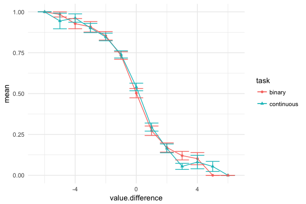

```{r Setup, include=FALSE}

```

# Introduction

## Rationale
We are interested to see whether the size of the interaction depends on the type of response/task that participants have to complete. We expect that the interaction term should be smaller for participants who complete the binary task than those that complete the continuous, strength-of-preference task. 

# Method

```{r Preprocessing, include=FALSE}

```

## Participants and apparatus
```{r Descriptive statistics, include=FALSE}

```

All participants were recruited from the University of Warwick’s volunteer subject pool and paid £10 for their participation.

Participants were tested individually using an EyeLink 1000 Plus (SR Research, Osgoode, ON, Canada) eye-tracker. Monocular eye movements were recorded at 500Hz and fixations were identified by the eye tracker using velocity algorithms. The Areas of Interest were defined as a rectangle around the image position(s) on the screen. The experiment was displayed on a widescreen monitor (1920 x 1080 resolution, refresh). Participants were placed on a chinrest approximately 70cm away from the screen. Stimulus presentation was controlled by MATLAB using Psychtoolbox extensions [@Brainard1997, @Pelli1997].

## Design

All participants completed binary choice and strength-of-preference tasks in a counterbalanced order, followed by a final valuation task where they had to rate their overall liking for each picture on a Likert scale. 

## Stimuli and choices

The stimuli were chosen from the International Affective Picture System [@Lang:2008]. The pictures were all mildly positive in affect (average, male and female ratings between 5=neutral and 7=mildly positive) and had differences in value ratings of no more than 1.5 between men and women. Furthermore, after visual inspection, 7 images were removed for containing pornographic images and 32 images were removed because the had a portrait aspect ratio. The 200 stimuli for each participant were randomly sampled without replacement from the 253 pictures that met these criteria. The participant's choices were generated by pairing the first stimulus with the hundred-and-first, the second with the hundred-and-second and so forth. 

## Procedure

The experiment was displayed on a black background with white text and response scales. At the beginning of the experiment the participants were asked to provide their age and gender. Then, participants completed three tasks: the binary choice task, the strength-of-preference task and the valuation task. The order of the binary choice and strength-of-preference tasks were counterbalanced between participants. For each task, the participants were shown the instructions for the task, then the eye-tracker was calibrated and then they were shown a reminder of the task instructions at which point they had to give a left mouse click to start the task. For all tasks, the calibration of the eye-tracker was checked every 25 trials and at the beginning of each trial, a fixation cross was displayed in the center of the screen until the participant had looked at it. 

In both of the choice tasks, two landscape stimuli (each 514 x 384px) were displayed side by side after the fixation cross. The response scale was presented horizontally centered, below the stimuli. For the binary choice task, two labels ("Option A" and "Option B") were shown underneath the appropriate stimuli. The current choice was signified by a red, square marker (30 x 30px) above the label. For the strength of preference task, the response scale was a white bar displayed underneath the stimuli that extended from the middle of one stimulus to the middle of the other. A red marker slid along the bar to signify the amount of preference for each option. The end of the scales were marked "Option A" and "Option B." In this task participants could move the marker to any point along the line using the mouse. In both tasks, the marker was initially centered equidistance between the two images. To respond in both tasks, the participants had to press the left mouse button. Reaction times were measured from the start of the trial to the beginning of the mouse click (i.e. the program did not wait for the release of the mouse button). A blank, black screen was displayed for 500ms between each trial.

In the final, valuation task, participants judged how much they liked each picture on a vertical Likert scale (1=strongly dislike, 7=strongly like). Each of the 200 stimuli were displayed once in a random order. Participants were offered the chance to take a self-paced break every 50 stimuli. A blank, black screen was displayed for 500ms between each rating. Throughout the experiment, the eye-tracker was validated every 25 trials.

## Analysis
The continuous scale was split into a hundred bins. The analysis was pre-registered at \url{AsPredicted.org}. Areas of interest were defined as the area of the stimulus and a box around the response scales. 

# Results

Data from all experiments reported in this article are publically available via the Open Science Framework (\url{https://osf.io/xfc8a/}).

## Exclusions
Participants were excluded on a task by task basis. Previous research indicates that some participants spend a considerable amount of time off task. Here, we excluded participants whose proportion of time spent on task during each trial (looking at either stimuli or the response scale). One participant was found to be an outlier in the binary task (i.e. averaged proportion of time spent on task was less than the first quartile minus 1.5 times the interquartile range) and their data was removed. This left 53 participants. 

Additionally, we excluded trials for which the reaction time was less that 200ms or greater than the mean plus three standard deviations (calculated across all trials). 

## Reaction times
<table style="text-align:center"><caption><strong>Summary of coefficients of model predicting reaction time</strong></caption>
<tr><td colspan="2" style="border-bottom: 1px solid black"></td></tr><tr><td style="text-align:left"></td><td><em>Dependent variable:</em></td></tr>
<tr><td></td><td colspan="1" style="border-bottom: 1px solid black"></td></tr>
<tr><td style="text-align:left"></td><td>rt</td></tr>
<tr><td colspan="2" style="border-bottom: 1px solid black"></td></tr><tr><td style="text-align:left">attention.difference</td><td>-65.120</td></tr>
<tr><td style="text-align:left"></td><td>(84.291)</td></tr>
<tr><td style="text-align:left"></td><td></td></tr>
<tr><td style="text-align:left">value.difference</td><td>-1.856</td></tr>
<tr><td style="text-align:left"></td><td>(10.763)</td></tr>
<tr><td style="text-align:left"></td><td></td></tr>
<tr><td style="text-align:left">taskcontinuous</td><td>663.016<sup>***</sup></td></tr>
<tr><td style="text-align:left"></td><td>(32.874)</td></tr>
<tr><td style="text-align:left"></td><td></td></tr>
<tr><td style="text-align:left">attention.difference:value.difference</td><td>-178.467<sup>***</sup></td></tr>
<tr><td style="text-align:left"></td><td>(38.468)</td></tr>
<tr><td style="text-align:left"></td><td></td></tr>
<tr><td style="text-align:left">attention.difference:taskcontinuous</td><td>69.555</td></tr>
<tr><td style="text-align:left"></td><td>(122.382)</td></tr>
<tr><td style="text-align:left"></td><td></td></tr>
<tr><td style="text-align:left">value.difference:taskcontinuous</td><td>2.232</td></tr>
<tr><td style="text-align:left"></td><td>(15.260)</td></tr>
<tr><td style="text-align:left"></td><td></td></tr>
<tr><td style="text-align:left">attention.difference:value.difference:taskcontinuous</td><td>-60.022</td></tr>
<tr><td style="text-align:left"></td><td>(54.609)</td></tr>
<tr><td style="text-align:left"></td><td></td></tr>
<tr><td style="text-align:left">Constant</td><td>2,500.064<sup>***</sup></td></tr>
<tr><td style="text-align:left"></td><td>(127.035)</td></tr>
<tr><td style="text-align:left"></td><td></td></tr>
<tr><td colspan="2" style="border-bottom: 1px solid black"></td></tr><tr><td style="text-align:left">Observations</td><td>5,115</td></tr>
<tr><td style="text-align:left">Log Likelihood</td><td>-43,241.430</td></tr>
<tr><td style="text-align:left">Akaike Inf. Crit.</td><td>86,502.870</td></tr>
<tr><td style="text-align:left">Bayesian Inf. Crit.</td><td>86,568.270</td></tr>
<tr><td colspan="2" style="border-bottom: 1px solid black"></td></tr><tr><td style="text-align:left"><em>Note:</em></td><td style="text-align:right">\*p<0.1; \*\*p<0.05; \*\*\*p<0.01</td></tr>
</table>

## Choice
<table style="text-align:center"><tr><td colspan="2" style="border-bottom: 1px solid black"></td></tr><tr><td style="text-align:left"></td><td><em>Dependent variable:</em></td></tr>
<tr><td></td><td colspan="1" style="border-bottom: 1px solid black"></td></tr>
<tr><td style="text-align:left"></td><td>recodedResponse</td></tr>
<tr><td colspan="2" style="border-bottom: 1px solid black"></td></tr><tr><td style="text-align:left">attention.difference</td><td>5.677<sup>***</sup></td></tr>
<tr><td style="text-align:left"></td><td>(0.440)</td></tr>
<tr><td style="text-align:left"></td><td></td></tr>
<tr><td style="text-align:left">value.difference</td><td>0.891<sup>***</sup></td></tr>
<tr><td style="text-align:left"></td><td>(0.062)</td></tr>
<tr><td style="text-align:left"></td><td></td></tr>
<tr><td style="text-align:left">taskcontinuous</td><td>-0.013</td></tr>
<tr><td style="text-align:left"></td><td>(0.084)</td></tr>
<tr><td style="text-align:left"></td><td></td></tr>
<tr><td style="text-align:left">attention.difference:value.difference</td><td>0.060</td></tr>
<tr><td style="text-align:left"></td><td>(0.174)</td></tr>
<tr><td style="text-align:left"></td><td></td></tr>
<tr><td style="text-align:left">attention.difference:taskcontinuous</td><td>0.574</td></tr>
<tr><td style="text-align:left"></td><td>(0.416)</td></tr>
<tr><td style="text-align:left"></td><td></td></tr>
<tr><td style="text-align:left">value.difference:taskcontinuous</td><td>0.022</td></tr>
<tr><td style="text-align:left"></td><td>(0.054)</td></tr>
<tr><td style="text-align:left"></td><td></td></tr>
<tr><td style="text-align:left">attention.difference:value.difference:taskcontinuous</td><td>-0.112</td></tr>
<tr><td style="text-align:left"></td><td>(0.258)</td></tr>
<tr><td style="text-align:left"></td><td></td></tr>
<tr><td style="text-align:left">Constant</td><td>0.017</td></tr>
<tr><td style="text-align:left"></td><td>(0.068)</td></tr>
<tr><td style="text-align:left"></td><td></td></tr>
<tr><td colspan="2" style="border-bottom: 1px solid black"></td></tr><tr><td style="text-align:left">Observations</td><td>5,115</td></tr>
<tr><td style="text-align:left">Log Likelihood</td><td>-1,881.974</td></tr>
<tr><td style="text-align:left">Akaike Inf. Crit.</td><td>3,785.949</td></tr>
<tr><td style="text-align:left">Bayesian Inf. Crit.</td><td>3,857.888</td></tr>
<tr><td colspan="2" style="border-bottom: 1px solid black"></td></tr><tr><td style="text-align:left"><em>Note:</em></td><td style="text-align:right"><sup>*</sup>p<0.1; <sup>**</sup>p<0.05; <sup>***</sup>p<0.01</td></tr>
</table>

<table style="text-align:center"><caption><strong>Comparing linear probability model, with recoded continuous repsonses.</strong></caption>
<tr><td colspan="3" style="border-bottom: 1px solid black"></td></tr><tr><td style="text-align:left"></td><td colspan="2"><em>Dependent variable:</em></td></tr>
<tr><td></td><td colspan="2" style="border-bottom: 1px solid black"></td></tr>
<tr><td style="text-align:left"></td><td>response</td><td>recodedResponse</td></tr>
<tr><td style="text-align:left"></td><td><em>linear</em></td><td><em>generalized linear</em></td></tr>
<tr><td style="text-align:left"></td><td><em>mixed-effects</em></td><td><em>mixed-effects</em></td></tr>
<tr><td style="text-align:left"></td><td>(1)</td><td>(2)</td></tr>
<tr><td colspan="3" style="border-bottom: 1px solid black"></td></tr><tr><td style="text-align:left">attention.difference</td><td>0.510<sup>***</sup></td><td>6.461<sup>***</sup></td></tr>
<tr><td style="text-align:left"></td><td>(0.033)</td><td>(0.509)</td></tr>
<tr><td style="text-align:left"></td><td></td><td></td></tr>
<tr><td style="text-align:left">value.difference</td><td>0.081<sup>***</sup></td><td>0.886<sup>***</sup></td></tr>
<tr><td style="text-align:left"></td><td>(0.005)</td><td>(0.061)</td></tr>
<tr><td style="text-align:left"></td><td></td><td></td></tr>
<tr><td style="text-align:left">attention.difference:value.difference</td><td>-0.001</td><td>-0.032</td></tr>
<tr><td style="text-align:left"></td><td>(0.009)</td><td>(0.214)</td></tr>
<tr><td style="text-align:left"></td><td></td><td></td></tr>
<tr><td style="text-align:left">Constant</td><td>0.503<sup>***</sup></td><td>-0.005</td></tr>
<tr><td style="text-align:left"></td><td>(0.006)</td><td>(0.076)</td></tr>
<tr><td style="text-align:left"></td><td></td><td></td></tr>
<tr><td colspan="3" style="border-bottom: 1px solid black"></td></tr><tr><td style="text-align:left">Observations</td><td>2,547</td><td>2,547</td></tr>
<tr><td style="text-align:left">Log Likelihood</td><td>-32.918</td><td>-941.290</td></tr>
<tr><td style="text-align:left">Akaike Inf. Crit.</td><td>83.835</td><td>1,898.579</td></tr>
<tr><td style="text-align:left">Bayesian Inf. Crit.</td><td>136.419</td><td>1,945.321</td></tr>
<tr><td colspan="3" style="border-bottom: 1px solid black"></td></tr><tr><td style="text-align:left"><em>Note:</em></td><td colspan="2" style="text-align:right"><sup>*</sup>p<0.1; <sup>**</sup>p<0.05; <sup>***</sup>p<0.01</td></tr>
</table>

## Looking at value.difference against pLeft




# Experiment running notes
Participant 6, 9, 11, 14, 15, 24, 26, 34, 42, 47: calibration and validation seemed to go very well, but fixation cross did not work for them.
Participant 10, 22: fixation cross started going weird towards the end. Perhaps didn't complete the rating task. 
Participant 20, 39: could not calibrate

# People to email results
najmi.husaini@warwick.ac.uk

# Pre-registration information
For submission to aspredicted.org

## Data collection. 
No, no data have been collected for this study yet. 

## Hypothesis. What's the main question being asked or hypothesis being tested in this study?
We are interested in the effects of attention (as measured by time spent looking at an object using eye-tracking) and value (as elicited from the subjects directly via ratings) when determining choices between two objects (such as between two bags of chips, or two pictures of nature, or between two fruits). In previous experiments, we have found that choice is predicted by an interaction of attention and value: people attend to objects they like more and are more likely to choose them. However, in other experiments there are only additively separable effects of attention and value on choice: people are more likely to pick the option they value more and/or they are more likely to choose the option they attend to more, but that these effects do not interact (i.e. looking more does not have a bigger effect when the value difference is bigger). 
 
The current experiment will attempt to identify which properties lead to the interactive vs. additive effect of attention and value. Here, we will compare simple binary choice between two pictures (Would you prefer Picture A or Picture B on your wall?) with a strength of preference comparison (By how much would you prefer Picture A over Picture B, or vice versa?). We hypothesise that the size of the interaction term will be greater in the strength-of-preference condition than in the choice condition. 

## Dependent variable. Describe the key dependent variable(s) specifying how they will be measured.
The dependent variables will be the choice that each participant makes on each trial, the proportion of time spent looking at each option on each trial and the number of fixations of each option on each trial. 

## Conditions. How many and which conditions will participants be assigned to?
Each participant will complete both a binary choice tasks and a binary evaluation task in a counterbalanced order. 

## Analyses. Specify exactly which analyses you will conduct to examine the main question/hypothesis.

## Outliers and Exclusions. Describe exactly how outliers will be defined and handled, and your precise rule(s) for excluding observations.

We will flag participants in the following circumstances:

1. Eye-tracking calbration: Some individuals cannot be calibrated to the eye tracker, usually due to the physiology of their eye. Anyone who cannot be calibrated with our eye tracking equipment will be flagged. 

2. It is common that for a minority of subjects, despite accurate measurements during the calibration procedure, the quality of their eye tracking data during the task is poor. We will exclude these by measuring the proportion of each trial where there is a valid gaze location recording, and the proportion of each trial where attention was measured as being within an Area Of Interest. Subjects who fall outside 3 standard deviations away from the mean on either of these measures will be flagged. 

3. Participants who have autocorrelation in their choices that falls outside 3 standard deviations from the mean will be flagged. 

4. Participants whose mean entropy falls outside 3 standard deviations from the mean will be flagged. 

If there are significant differences between the first and second tasks (i.e. order effects), the second block will be excluded from further analyses. <!--How exactly are we checking that exactly?-->

Trials for which the reaction time was shorter than 200ms and above the participant's mean reaction time plus 3 S.D. will be excluded. 

## Sample Size. How many observations will be collected or what will determine sample size?
We will run testing until either a) we collect the data of 50 participants after exclusions, or b) we attempt data collection from 80 participants; whichever comes first. 

## Other. Anything else you would like to pre-register? 
We will collect age, and gender for all participants. We will not report the summary statistics of these variables, nor include them as covariates in our regression analyses, unless requested by referees during the publication process.

# References
